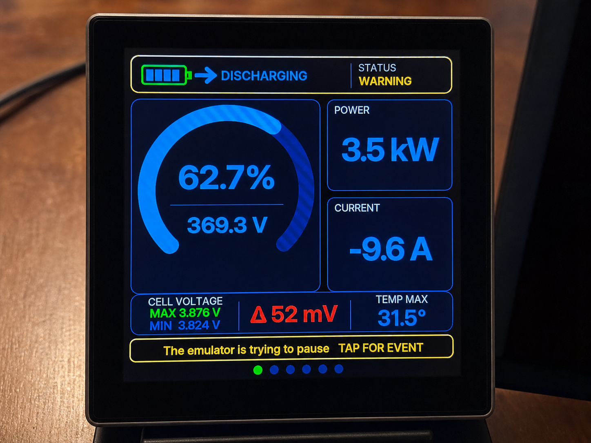
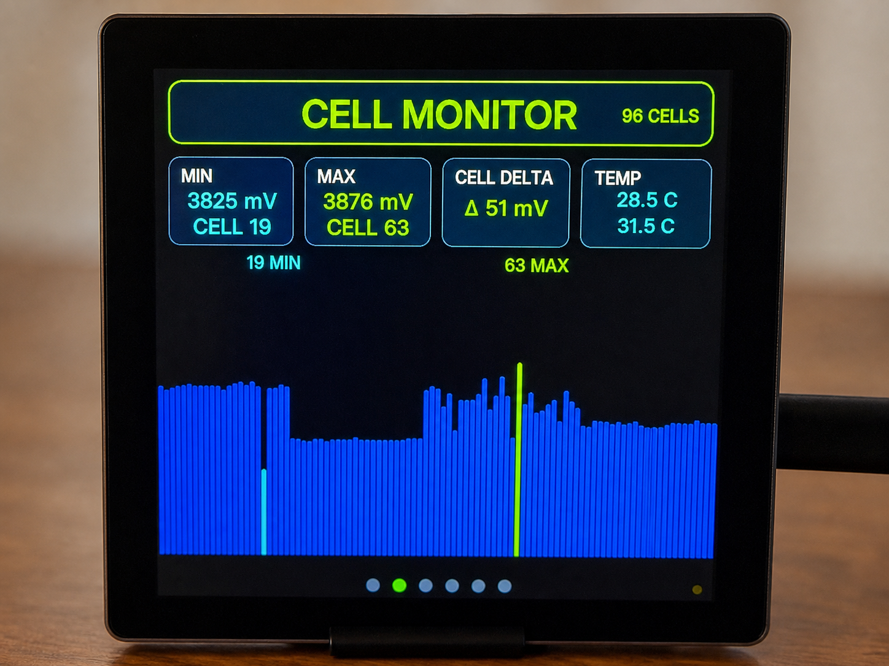
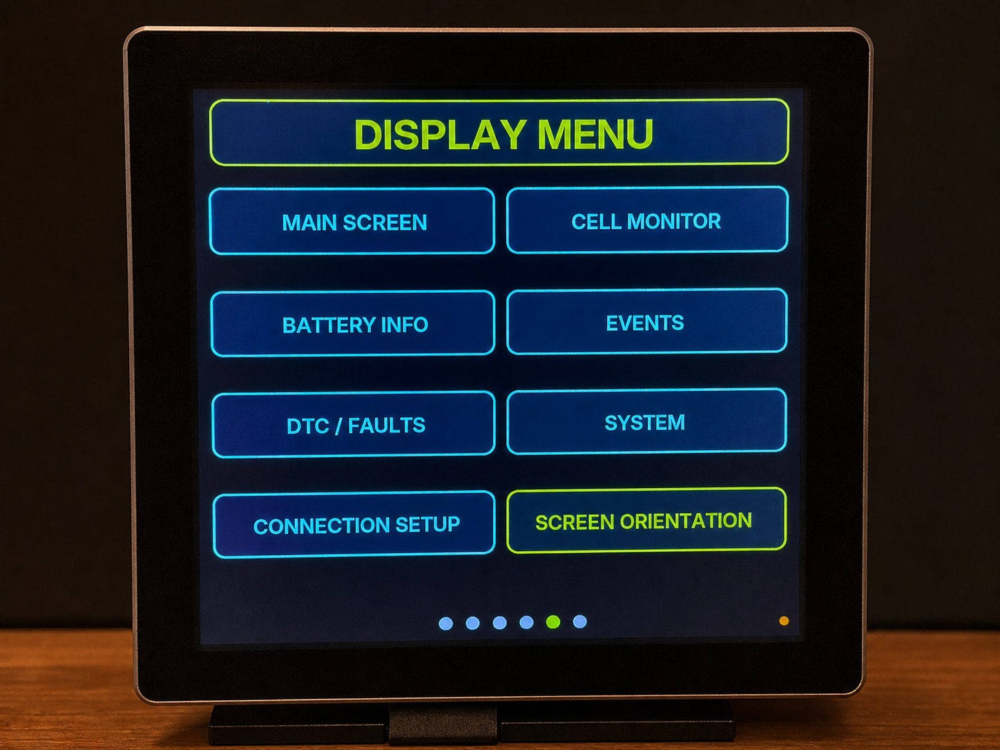
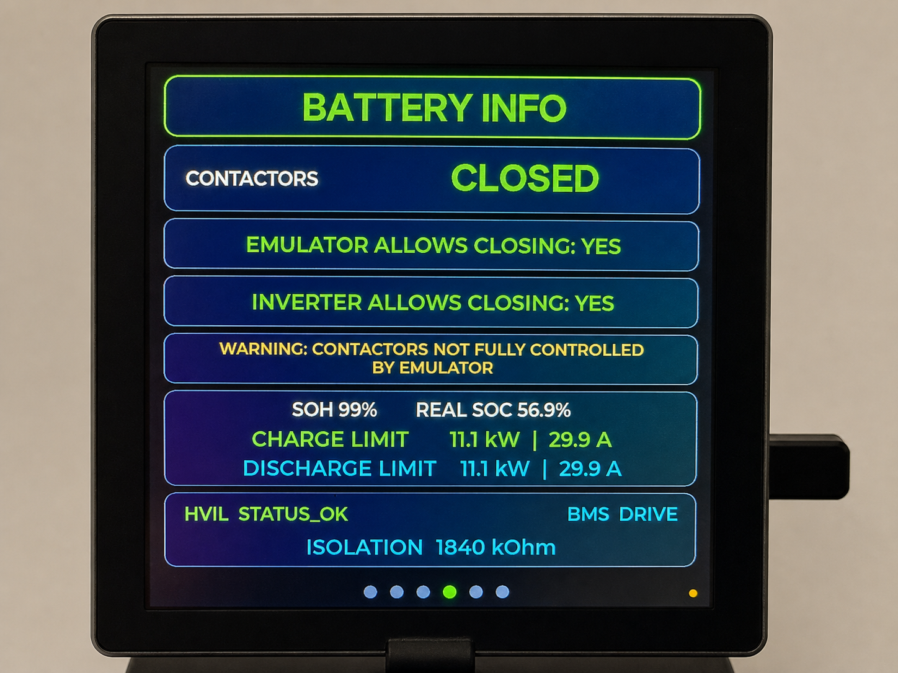
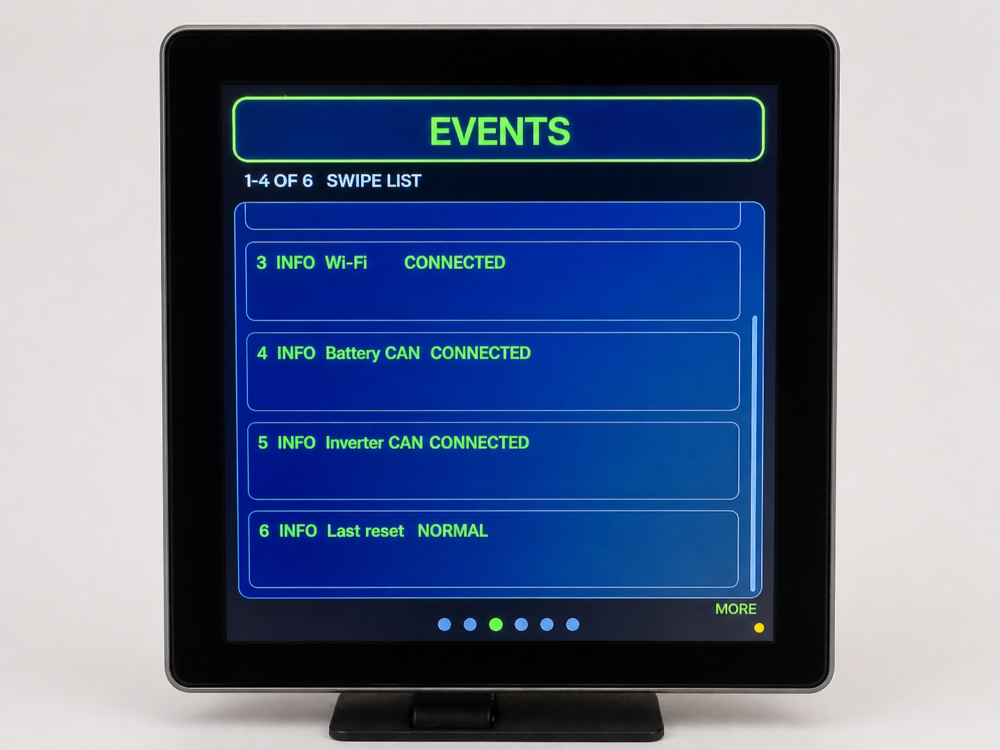
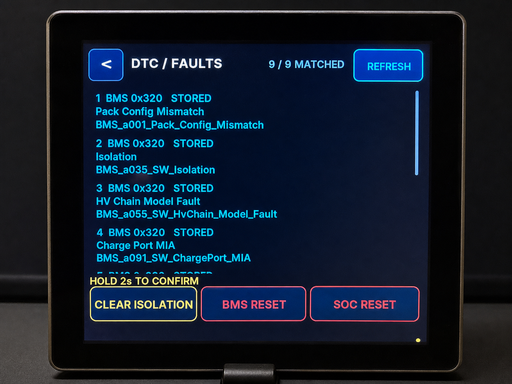
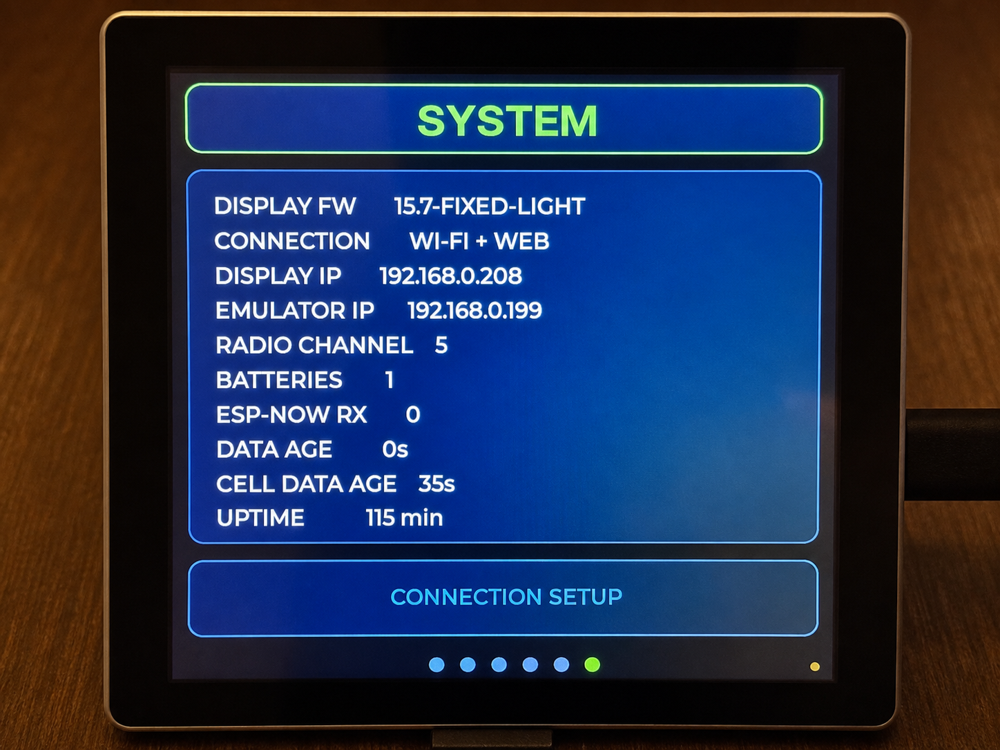

# Battery Display 480×480 — v15.7 Fixed Backlight Menu

Это развитие проверенной v15.5 для платы **ESP32-4848S040C-I**. Настройки яркости полностью удалены, подсветка зафиксирована на стабильных 100%. Display Menu оформлено как равномерная сетка 2×4, а Screen Orientation находится в нижней правой ячейке.

**[Открыть установщик 480×480](https://sort282-rgb.github.io/battery-display-esp32-4848s040c/installer/)** — нужен Chrome или Edge и USB-кабель с передачей данных. На [странице выбора устройства](https://sort282-rgb.github.io/battery-display-esp32-4848s040c/) также есть ссылка на отдельный установщик LILYGO T-Display-S3.

## Быстрая установка через веб

1. На Windows запустите `START-WEB-INSTALLER.cmd` двойным щелчком.
2. Откроется страница `http://localhost:8000/installer/`.
3. Подключите дисплей USB-кабелем.
4. В Chrome или Edge нажмите **Подключить и обновить**.
5. Выберите USB Serial / COM-порт дисплея.

Режим **Обновить прошивку** сохраняет Wi-Fi, ESP-NOW, канал и остальные настройки NVS. Режим **Стереть и установить** полностью очищает плату и предназначен только для новой установки или восстановления.

После завершения закройте отдельное окно веб-сервера. Скрипт автоматически использует Python из PlatformIO или обычный Python. Если их нет, папку можно опубликовать без изменений на любом статическом HTTPS-хостинге, включая GitHub Pages.

## Примеры экранов

| Главный экран | Монитор ячеек |
| --- | --- |
|  |  |

| Меню дисплея | Информация о батарее |
| --- | --- |
|  |  |

| События | Ошибки DTC |
| --- | --- |
|  |  |

| Системная информация |
| --- |
|  |

## Сборка из исходников

```text
pio run -e esp32-4848s040c
python scripts/package_release.py
```

Вторая команда проверяет manifests, отсутствие приватных значений и зафиксированные SHA-256 физически проверенных бинарников; она не заменяет их результатом новой сборки. Исходники, определение платы, веб-страница, манифесты и все бинарники входят в эту папку.
